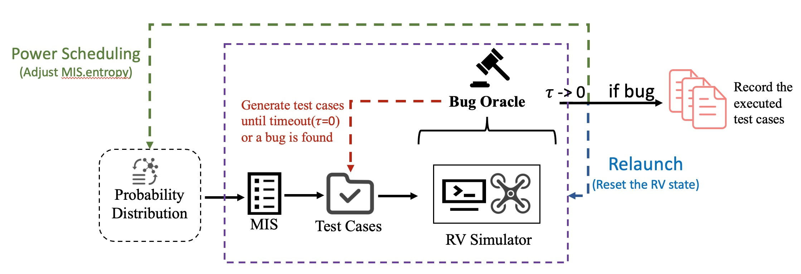

## ADGFuzz

### 1. Introduce 

ADGFuzz is a prototype fuzzing framework targeting Robotic Vehicle (RV) control software. Its workflow begins by analyzing the source code of the target RV software to identify all assignment statements at the function level, which are then used to construct Assignment Dependency Graphs (ADGs). Each variable in an ADG is decomposed into terms, which are then mapped—via synonym tables and association rules—to inputs accepted by the RV, resulting in Matched RV Input Subsets (MISs). During this process, we also measure the entropy of each MIS and use these values to build a probability distribution (P). 

In the fuzzing phase, MISs are sampled according to this probability distribution, and a new RV simulator instance is launched for each test. ADGFuzz runs multiple bug oracles in parallel during fuzzing to monitor for software crashes, vehicle crashes (hitting the ground), and route deviations in real time. All test cases that successfully trigger bugs are recorded for post-processing, where we minimize and deduplicate the bug-triggering inputs.


#### Code Structure

```
.
├── README.md
├── data  # Used for generating test cases (assignments) during fuzzing
    ├── ap-copter-v470.csv      # Configuration parameters for ArduCopter, including name, increment, range/value/bitmask
    ├── ap-plane-v470.csv       # Configuration parameters for ArduPlane, including name, increment, range/value/bitmask
    ├── ap-rover-v470.csv       # Configuration parameters for Rover, including name, increment, range/value/bitmask 
    ├── mav_cmds1.csv           # Configuration parameters for PX4-copter, including name, increment, range/value/bitmask   
    └── webparse_param.py, param_split_term.py, parse_mavcmd_param7.py, parse_params_px4.py, parse_enum.py  # Scripts used to generate the csv data above
├── fuzzer
    ├── fuzz.py        # Main program for the fuzzing phase; accepts MISs, converts entropy to probability distributions and dynamically adjusts them, interacts with the RV
    ├── fuzzpx4.py     # [added during major revision] Main fuzzing program for PX4
    ├── oracle.py      # Captures three types of bugs: Software Crash, Route Deviation, and Hit Ground
    ├── runtimedict.py # Uses CSV files in the data folder to construct test cases
    ├── postprocess.py # For Post-Processing
    └── rvmethod.py    # Implements interaction with the RV using pymavlink: sending RV inputs and receiving status messages
├── model
    ├── constant.py    # Constants
    └── Mapping.py     # Program for converting ADG to MIS
├── missiondata
├── map                # Stores the synonym table and physical coupling table mentioned in Fig. 4 of the paper, as well as RV input terms
├── outfile            # Fuzzing results
├── static
    ├── initpath       # Stores ADG files generated from static analysis of ArduPilot source code
    ├── px4path        # [added during major revision] Stores ADG files generated from static analysis of PX4 source code
    └── tree_parse.py  # Main program for the static analysis phase; converts RV source code to ADG
├── adgfuzz.py         # Main program entry point
└── quickcheck.py      # Quickly verifies which bugs have been discovered
```


### 2. Setup & Install

#### 2.1 Recommended: Use the Provided Ubuntu Virtual Machine

Users can directly downloading our pre-configured Ubuntu virtual machine. 

- For **AMD/x86_64 platforms** (e.g., Windows systems), please [download](https://doi.org/10.5281/zenodo.16956667) the `Ubuntu-ADGFuzz.ova` file and import it into **VMWare** or **VirtualBox**. 

- For **ARM64 platforms** (e.g., Apple Silicon, M1 and above), please [download](https://drive.google.com/file/d/1Bpu00TqwpRkaxorodoglipm_bu2xSF9o/view?usp=sharing) `ADGFuzz-ARM.pvm.zip`, extract it, and run the resulting `ADGFuzz-ARM.pvm` image using **Parallels Desktop** (recommended).

If you use this VM, **you can skip the manual installation steps below and proceed directly to §3 to start fuzzing within the virtual machine.**

**VM information**

- username: adgfuzz
- password: 1

Recommended VM settings: 16–32 GB memory (lower amounts may work but are untested), 1 processor × 4 cores (can be reduced to 2), and 60 GB storage space.


#### 2.2 SUT Installation

The versions of ArduPilot and PX4 we used are the baseline open-source releases obtained directly from their official GitHub repositories, without any modifications, optimizations, or commercial-grade enhancements (e.g., redundant sensors, collision avoidance, vibration damping, or sensor fusion algorithms). Our goal was to evaluate widely used open-source flight control software in its standard form, as this serves as the foundation for both research and development.

```shell
cd ~
mkdir work
cd ~/work
```

##### 2.2.1 ArduPilot Installation

```bash
sudo apt-get update
sudo apt-get install git
sudo apt-get install gitk git-gui

git clone https://github.com/ArduPilot/ardupilot.git ArduPilot
cd ArduPilot
git checkout 564879594ebb8d31c6400461b96f5dc442f14533
git submodule update --init --recursive

Tools/environment_install/install-prereqs-ubuntu.sh -y
. ~/.profile
```

You can test the installation with the following commands:

```bash
# Copter
./Tools/autotest/sim_vehicle.py -v ArduCopter --console --map -w --out=udp:127.0.0.1:14550 --out=udp:127.0.0.1:14551

# Plane
./Tools/autotest/sim_vehicle.py -v ArduPlane --console --map

# Rover
./Tools/autotest/sim_vehicle.py -v Rover --console --map
```


If you encounter errors, try updating the submodules and cleaning the build:

```bash
git submodule update --recursive
./waf clean
```

##### 2.2.2 PX4 Installation

```bash
git clone https://github.com/PX4/PX4-Autopilot.git PX4
cd PX4
git checkout d35c5f4a4e9515542d9527594f339cd97ab0c70b
git submodule update --init --recursive #[~10 minutes]

./Tools/setup/ubuntu.sh -y

### For jMAVSim (PX4 v1.11 and later), Java JDK 15+ is required:
### ----------
sudo apt install software-properties-common
sudo add-apt-repository ppa:openjdk-r/ppa
sudo apt update
sudo apt install openjdk-15-jdk #for ubuntu version > 22 : sudo apt install openjdk-17-jdk
sudo apt install openjdk-11-jdk ant
### ----------

bash Tools/setup/ubuntu.sh
make px4_sitl_default jmavsim
```

Trouble Shooting：

If you have a previous installation of gazebo, you may encounter errors such as:

> The following packages have unmet dependencies: gazebo11-plugin-base : Depends: gazebo11 (= 11.15.1-1~focal) but it is not going to be installed E: Unmet dependencies. Try 'apt --fix-broken install' with no packages (or specify a solution).

This may be due to conflicts from the previously installed `gz-tools2` package (which provides `/usr/bin/gz`). To resolve, force installation with:

`sudo apt-get -o Dpkg::Options::="--force-overwrite" install gazebo11 gazebo11-plugin-base`

`bash Tools/setup/ubuntu.sh`


#### 2.3 ADGFuzz Installation

Download ADGFuzz

```shell
cd ~/work
git clone https://github.com/wyunc/ADGFuzz.git
cd ADGFuzz
```

The runtime environment requires Python 3.8.10.

```bash
pip install -r requirements.txt
# Ignore non-critical warnings or errors during installation.
```

> Some parts related to argument parsing, term generation, and synonym table construction are currently hidden.
>
> If you use a different Python version(e.g., 3.10.12), it is also supported; however, you will need to modify `numpy==1.24.4` in `requirements.txt` to `numpy>=1.25,<2.0`.


**Prepare for Static Analysis** (Optional, recommended to skip)

```bash
#[ArduPilot] For test:  
python tree_parse.py --rvtype ap --subdirs ArduCopter
#[ArduPilot] For complete run: 
python tree_parse.py --rvtype ap --subdirs ArduCopter ArduPlane Rover libraries

#[PX4] For test: 
python tree_parse.py --rvtype px4 --subdirs modules/airspeed_selector
#[PX4] For complete run: 
python tree_parse.py --rvtype px4 --subdirs lib modules
```

Static analysis results for ArduPilot are stored in `/ADGFuzz/static/initpath`.
For PX4, results are stored in `/ADGFuzz/static/px4path`.

> **These directories store the pruned data of the Assignment Dependency Graphs (ADGs), with semi-dependent nodes removed, to facilitate faster generation of Matched RV Input Subsets (MISs) in subsequent stages.**


### 3. ADGFuzz

**General Workflow:**

After executing the `adgfuzz.py` script, the following steps are performed:

 (1) Based on the ADGs generated during the static analysis phase, term association tables (including synonym table and physical coupling table) are used to convert the ADGs into Matched RV Input Subsets (MISs);  **(~2 compute-minutes)**

 (2) An RV simulator instance is launched; **(< 1 compute-minute)**

 (3) An MIS is selected for test case generation according to an entropy-based probability distribution, while three parallel threads are used to serve as bug oracles during fuzzing; **(~a few seconds to a few minutes)**

 (4) If a bug is detected, the entropy value of the corresponding MIS and the probability distribution are updated accordingly. Finally, the simulator is restarted to restore the RV to a clean state, and a new MIS is selected. Steps (2)–(4) are then repeated.

**Fuzzing Phase Workflow:**

The fuzzing process consists of three interacting modules running in parallel: (1) a Simulation Module, (2) an Execution Module, and (3) an Oracle Module. As shown in the following figure:



The Simulation Module launches a new SITL instance at the beginning of each iteration, loads a multi-phase navigation mission, and executes it automatically. The Execution Module first samples a MIS from an entropy-based probability distribu- tion as the input injection template for the current round, and sends the test input to the SITL once the RV enters the armed state (including takeoff, navigation, turning, etc.). Meanwhile, the Oracle Module runs in parallel during input execution to detect anomalies in the RV system. When a bug is detected or the execution times out, the entropy of the current MIS is updated and the probability distribution is adjusted in real time. The triggered test sequence is then passed to the post- processing module for further analysis.

**Bug Oracle Design and Implementation**

- *Software crash oracle*: Shared by both ArduPilot and PX4. We monitor whether MAVLink messages are still exchanged between the GCS and the RV. The implementation (`oracle.py->check_status()`) blocks until a message is received; if no message arrives after several retries, the RV software is considered crashed. Otherwise, captured messages are pushed into a queue for use by other oracles.

- *Crash on the ground oracle*: We check the RV’s state from captured messages.

  For ArduPilot: the `STATUSTEXT` message containing “Hit ground”, or a `HEARTBEAT` message with `system_status=6 (EMERGENCY)` or `system_status=7 (POWEROFF)`.

  For PX4: after takeoff, if a `GLOBAL_POSITION_INT` message indicates `landed_state=1`, or if an `EXTENDED_SYS_STATE` message shows absolute altitude < 1, the RV is considered "Crash on the ground".

- *Route deviation oracle*:

  For Copter and Rover: if the distance to the target waypoint increases continuously three times over five seconds.

  For Plane: since waypoint arrival involves circular loitering, we use a threshold of seven consecutive increases over twelve seconds.


**How to Run**

The `adgfuzz.py` script is used to launch our framework and supports the following parameters:

- `--initfile`: Specifies the initial ADGs to use for fuzzing.
- `--rvtype`: Sets the type of robotic vehicle (RV), which can be `copter`, `plane`, or `rover`.
- `--time`: Sets the fuzzing runtime (in seconds).
- `--out_path`: Specifies the output directory for saving results.


#### 3.1 Kick-the-tires stage (E1) [1 human-minutes, 5 compute-minutes]

We provide simple examples for the **Kick-the-tires** stage.

```bash
cd /home/adgfuzz/work/ADGFuzz 
export ARDUPILOT_HOME=/home/adgfuzz/work/ArduPilot/
# /Path/to/ADGFuzz

# [ArduPilot]-quicktest, run cmd:
python adgfuzz.py --initfile paths/testcopter/quicktest/ --rvtype copter --time 300 --out_path paths/quickresult/
```

The `paths/testcopter/quicktest/` directory contains a minimal "ADG-predecessor" file, which can be used to generate test cases that trigger software crashes.

**Result**: We have already conducted one test, and the results are saved in the `paths/quickresult_old/` directory.


#### 3.2 Small-scale Execution  [2 human-minutes, 1 compute-hours] 

Our experimental results (Table 2 and Figure 5) were obtained by running 24-hour fuzzing campaigns on Copter, Plane, and Rover, respectively. **Considering the time constraints of the AEC, we recommend performing a one-hour fuzzing run on Copter for evaluation.**

```bash
cd /home/adgfuzz/work/ADGFuzz
# - /Path/to/ArduPilot
export ARDUPILOT_HOME=/home/adgfuzz/work/ArduPilot/
# - /path/to/PX4 (Optional)
export PX4_HOME=/home/adgfuzz/work/PX4/

#or 
source env_set.sh
```

Then

```bash
# Copter
python adgfuzz.py --initfile static/initpath/ArduCopter/ static/initpath/libraries/ --rvtype copter --time 3600 --out_path outfile/copter/
```

> At the end of fuzzing (1 hour), the number of discovered bugs will be printed to the command line, for example:
>
> `2025-08-26 22:19:43 [INFO] [fuzz]: =================Fuzz Final Report==================`
>
> `
> 2025-08-26 22:19:43 [INFO] [fuzz]: find 28 bugs, average_round: 20.285714285714285 can found one bug, of which 11 are no_link (software crash) bugs, 3 are wp deviation bugs, 14 are status/instability bugs.`
>
> > The expected number of bugs found should be within 24~35 bugs.


#### 3.3 Full Execution (E2)  [2 human-minutes, 24 compute-hours]

> If time permits, you may also run a full 24-hour experiment.

```bash
# Copter
python adgfuzz.py --initfile static/initpath/ArduCopter/ static/initpath/libraries/ --rvtype copter --time 86400 --out_path outfile/copter/
# Rover
python adgfuzz.py --initfile static/initpath/Rover/ static/initpath/libraries/ --rvtype rover --time 86400 --out_path outfile/rover/
# Plane
python adgfuzz.py --initfile static/initpath/ArduPlane/ static/initpath/libraries/ --rvtype plane --time 86400 --out_path outfile/plane/

# Or, you can also use the `fuzz.sh` script to automatically run 3.3-copter.
./fuzz.sh

# For PX4-Copter
python adgfuzz.py --initfile static/px4path/lib/ static/px4path/modules/ --rvtype px4 --time 86400 --out_path outfile/px4_copter/
```

> Trouble Shooting: 
>
> Initialization times for ArduPilot may vary. By default, we use 50 seconds for ArduPilot and 30 seconds for PX4. If you encounter errors such as “AP: Arm: Need Position Estimate” in the SITL console, please increase the initialization time accordingly.


### 4. Result and Post-Processing 

#### 4.1 Result 

At the end of fuzzing (24 hours), the number of discovered bugs will be printed to the command line, for example:

```bash
2025-07-08 13:55:36 [INFO] [fuzz]: ==================Fuzz Final Report==================
2025-07-08 13:55:36 [INFO] [fuzz]: find 678 bugs, average_round: 23.617994100294986 can found one bug, of which 262 are no_link (software crash) bugs, 65 are route_deviation bugs, 351 are status/hit_ground bugs. 
#Software Crash, Route Deviation, and Hit Ground
```

> Note: Due to the stochastic nature of fuzzing, experimental results may vary.

If you would like to view all the bugs discovered by ADGFuzz, please refer to [this Google Document](https://docs.google.com/spreadsheets/d/1LEpcCKNHbQBdkHKfBqLBF6SJlf9FtJ-Rmq-ytg7FUbs/edit?usp=sharing).


#### 4.2 After execution: (Optional)  [<1 human-minutes]

Files named `dumpcore.sh_arducopter.{xxxx}.out` and `dumpstack.sh_arducopter.{xxxx}.out` are generated due to simulator crashes (arithmetic exceptions) and can be safely deleted.

```bash
rm -f dumpcore* dumpstack*
```

> The `logs` folder contains the runtime logs of the RV, with up to 500 log files generated by default. You can choose to delete or keep.
>
> `rm -f logs/*`


#### 4.3 Post-Processing [Each bug file requires ~10 human-minutes or 10 compute-minutes]

Each bug-triggering input file (e.g., `outfile/copter/bug{index}_{bugtype}_{foundtime}.txt`) requires ~10 minutes on average to minimize into a smallest bug-triggering input. This delay is due to the time (~60s) needed to reset SITL into a usable state, plus waiting time to capture bug manifestations after each execution.

- For *software crash bugs*, the script automatically finds minimized inputs.
- For *crash on the ground* and *route deviation bugs*, the time-to-trigger varies (sometimes 1s, sometimes >10s), so manual supervision is required. One author manually decided when to restart SITL and which test cases to re-run.

**Usage**:

Update `oracle.py` and `postprocess.py` from GitHub (https://github.com/wyunc/ADGFuzz).

Run:

```shell
python adgfuzz.py --bugpost True --out_path path/to/files
```

For example, running on the E1 results should yield a minimized input set including `TERRAIN_SPACING` and `TERRAIN_ENABLE` (note that `TERRAIN_ENABLE` is not necessary as long as its default value remains 1).

```shell
python adgfuzz.py --bugpost True --out_path paths/quickresult
```

Since full post-processing is time-consuming, we also provide a lightweight validation script `quickcheck.py`. It quickly scans `outfile/copter/` for known ADGFuzz bugs. Users can also modify line 95 to point to other directories.

```shell
python quickcheck.py
```

> Due to fuzzing randomness, some additional bugs (not reported in our paper) may occasionally be discovered by ADGFuzz.


#### 4.4. Manual Bug Reproduction  [5 human-minutes, 3 compute-minutes]

We provide a script, `test_ap.py`, which allows you to manually verify the bugs discovered during fuzzing. You can run this script after the fuzzing process to observe the effects of each bug.

```bash
python test_ap.py --init 1 --run 2 --file /path/to/your/bug.txt/file 
```

For example, in the `paths/quickresult_old/` directory, there is a file named `bug1_ArithmException_26.100122690200806.txt`, which contains inputs that can trigger a software crash. You can reproduce and observe the actual effect of this bug by executing the following command:

```bash
python test_ap.py --init 1 --run 2 --file paths/quickresult_old/bug1_ArithmException_26.100122690200806.txt
```

Note: If you want to close/exit RV emulator (SITL), press `Ctrl+C` in the newly opened 'Terminal' window

